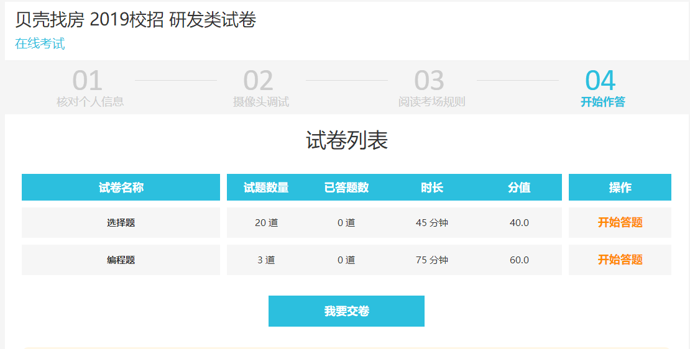

## 多米诺

**时间限制：**C/C++语言 1000MS；其他语言 3000MS
**内存限制：**C/C++语言 65536KB；其他语言 589824KB

**题目描述：**

多米诺骨牌大家想必都不陌生，现在有n块多米诺骨牌放在x轴上，每一块骨牌有一个所在位置下标和高度，每一块骨牌都只会向x轴正方向倒下，当处于位置x0，高度为h0的多米诺骨牌倒下，会压倒[x + 1, x + h - 1]内的所有多米诺骨牌，对于每一块骨牌。我们希望知道，如果我把这块骨牌推倒，那么至多可以倒下多少块骨牌。

输入

输入第一行包含一个正整数n，表示多米诺骨牌的数量 (1<=n<=10^5)

接下来n行，每行包含两个正整数x,h，分别表示第i块多米诺骨牌的位置和高度(-10^8<=x<=10^8,2<=h<=10^8)。保证不会有两块骨牌在同一高度。


输出

对于每个测试数据，输出一行， 包含n个正整数，第i个数字表示，如果推倒第i块多米诺骨牌，可以使得多少个骨牌倒下。

样例输入

```
4
16 5  => [17,20]
20 5  => [21,24]
10 10 => [11,19]
18 2  => [19,19]
```

样例输出

```
3 1 4 1
```


**参考代码**

```java
package interview.code_0903_贝壳找房;

import java.util.ArrayList;
import java.util.Scanner;

public class Main1 {
    public static void main(String[] args) {
        ArrayList<Integer> list = new ArrayList<>();
        Scanner in = new Scanner(System.in);

        int n = in.nextInt();
        int[] start = new int[n];
        int[] end = new int[n];
        for (int i = 0; i < n; i++) {
            int x = in.nextInt();
            int h = in.nextInt();
            start[i] = x + 1;
            end[i] = x + h - 1;
            list.add(x);
        }

        for (int i = 0; i < n; i++) {
            int count = getPushSize(start, end, list, i);
            if(i != n-1){
                System.out.print(count + " ");
            }
            else{
                System.out.print(count);
            }
        }
    }

    private static int getPushSize(int[] start, int[] end, ArrayList<Integer> list, int index) {
        int res = 1;
        int x = start[index];
        int y = end[index];

        for (int i = 0; i < list.size(); i++) {
            int item = list.get(i);
            if (item >= x && item <= y) {
                res++;
            }
        }
        return res;
    }


}

```

输出结果

```
说明：
所有测试数据正确率为 27%！
可以尝试再次完善代码，并调试，争取全部AC通过
```


## 计算器

**时间限制：**C/C++语言 1000MS；其他语言 3000MS
**内存限制：**C/C++语言 65536KB；其他语言 589824KB

**题目描述：**

假设有这样一个计算器，该计算器只有两个按钮，按下第一个按钮能使显示数值减少1，按下第二个按钮能使显示数值乘以2，当前显示数值为N，那么至少要按多少次按钮才能使显示数值变成M？

输入

输入两个整数N和M，1≤N，M≤109。

输出

输出使显示数值变成M的最少按按钮次数。

样例输入

```
4 5
```

样例输出

```
3
```


输出结果

```
说明：
所有测试数据正确率为 27%！
可以尝试再次完善代码，并调试，争取全部AC通过
```


**参考代码**

```java
package interview.code_0903_贝壳找房;

import java.util.HashSet;
import java.util.Scanner;

public class Main2 {
    public static void main(String[] args){
        Scanner in = new Scanner(System.in);
        long n = in.nextInt();
        long m = in.nextInt();

        boolean deOne = true;
        int count = 0;
        HashSet<Long> set = new HashSet<>();

        int test = 0;
        while (n != m) {

            set.add(n);
            if (deOne) {
                n = n - 1;
                deOne = false;
            } else {
                n = n * 2;
                deOne = true;
            }
            count++;
            if(n > m+1){
                return;
            }
            if(n > 500000000){
                return;
            }

//            System.out.println("N当前值"+test+"："+n);
//            test++;
        }
        System.out.print(count);
    }
}

```


## 家族关系

**时间限制：**C/C++语言 1000MS；其他语言 3000MS
**内存限制：**C/C++语言 65536KB；其他语言 589824KB

**题目描述：**

小明和小红是亲兄妹，他俩一起翻了翻他们家的族谱，发现他们家非常庞大，有非常多的名字在族谱里面。族谱中会写清楚每一个人的父亲是谁，当然每个人都只会有一个父亲。

对于祖先的定义，我们在这儿举个例子：族谱里面会写小王的父亲是小丁，小丁的父亲是小东，那么实际上小东就是小王的爷爷，也是小王的祖先。

小明很聪明，小明理了理他们的家庭关系，很快就弄清楚了，知道了族谱中每一个人的祖先关系。

但是小红却依旧困惑，于是问了很多问题，希望你能够解答。

小红的问题是，请问A是B的祖先关系是什么？究竟A是不是B的祖先，或者说B是A的祖先，亦或者B和A不存在祖先关系呢。


输入

输入第一行包括一个整数n表示家族成员个数。

接下来n行每行一对整数对a和b表示a是b的父亲，或者b是a的父亲，这需要你来判断。

如果b是-1，那么a就是整个家族的根，也就是辈分最大的人，保证只有一个。

第n+2行是一个整数m表示小红的询问个数。

接下来m行，每行两个正整数A和B。

表示小红想知道A是B的祖先关系。

n,m≤40000，每个节点的编号都不超过40000。

输出

对于每一个询问。

输出1表示A是B的祖先，输出2表示B是A的祖先，都不是输出0

样例输入

```
10
1 -1
3 1
4 1
5 1
6 1
7 1
8 1
9 1
10 1
2 10
5
1 2
2 3
2 4
2 5
2 10
```

样例输出

```w
1
0
0
0
2
```


输出结果

```
说明：
所有测试数据正确率为 88%！
可以尝试再次完善代码，并调试，争取全部AC通过
```


**参考代码**

```java
package interview.code_0903_贝壳找房;

import java.util.HashMap;
import java.util.Scanner;

public class Main3 {
    public static HashMap<Integer, Integer> map = new HashMap<>();

    public static void main(String[] args){
        Scanner in = new Scanner(System.in);
        int n = in.nextInt();
        for (int i = 0; i < n; i++) {
            int a = in.nextInt();
            int b = in.nextInt();
            map.put(a, b);
        }
        int m = in.nextInt();
        for (int i = 0; i < m; i++) {
            int a = in.nextInt();
            int b = in.nextInt();
            boolean aisb = getAisBfather(a,b);
            int result = 0;
            if(aisb){
                result = 1;
            }
            else{
                if(getAisBfather(b,a)){
                    result = 2;
                }
            }
            if(i!= m-1){
                System.out.println(result);
            }
            else{
                System.out.print(result);
            }
        }
    }

    private static boolean getAisBfather(int a, int b) {
        if (a == b) {
            return false;
        }

        int count = 0;
        int nowRoot = b;
        while (map.get(nowRoot) != -1 && count <= 10) { //  == -1 到根节点 查找结束
            nowRoot = map.get(nowRoot);
            if (nowRoot == a) {
                return true;
            }
            count++;
        }
        return false;
    }
}
```


